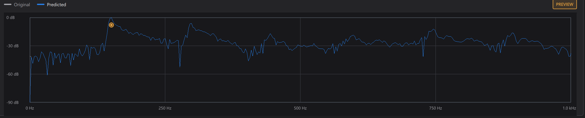
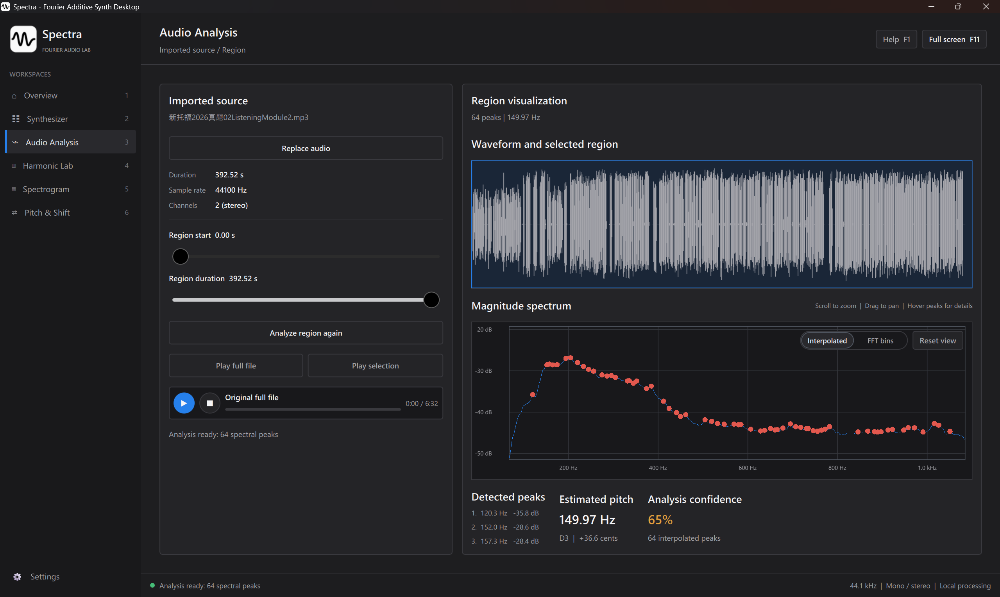

# Spectra

[](https://github.com/Ethan-H147/Spectra/actions/workflows/windows.yml)
[](LICENSE)

Spectra is a desktop application for inspecting Fourier representations of audio. The canonical interface uses Qt Quick and QML. The signal-processing core uses C99.

Raylib remains a runtime dependency for audio decoding and playback. It no longer controls the canonical application layout.

## Repository status

`spectra_qt` is the primary application and the default frontend.

The `raylib-v1` tag preserves the retired Raylib-first application. The current source tree contains only the Qt frontend.

Generated build trees, compiled binaries, editor state, and local audio files are not stored in the repository.

## Download

Published Windows builds are available on the [Releases page](https://github.com/Ethan-H147/Spectra/releases). Most users should download `Spectra-1.0.0-windows-x64-setup.exe`. The installer adds a Start Menu shortcut and an uninstaller without requiring administrator access.

The portable `Spectra-1.0.0-windows-x64.zip` package requires no installation. Extract the complete `Spectra` directory and run `Spectra\bin\spectra_qt.exe`. Keep the executable beside the bundled `Qt6`, plug-in, and DLL files.

Each package includes a `.sha256` file for integrity verification. The first release is not code-signed, so Windows can display an unknown-publisher warning for the installer.

## Screenshots

### Spectrum movement



### Full-track audio analysis



## Functions

Spectra provides eight workspaces:

1. **Overview** reports source, analysis, reconstruction, and audio-device state.
2. **Synthesizer** generates tones from 16 adjustable harmonics.
3. **Audio Analysis** displays a waveform, spectrum, peaks, and pitch estimate.
4. **Harmonic Lab** compares harmonic-only resynthesis with an evolving Fourier reconstruction across a selectable 1–8 second passage.
5. **Spectrogram** displays STFT magnitude, exports the visualization as a landscape PDF, and builds complete-file reconstructions.
6. **Pitch & Shift** builds tape-speed, duration-preserving pitch, and fixed-Hz frequency effects with an overlaid before/after spectrum.
7. **Range EQ** lets you zoom, pan, and fit the horizontal frequency axis or return to the full 0 Hz-to-Nyquist range. Draw smooth bands on the full-track spectrum, stack overlapping gains, and compare predicted with measured output.
8. **Settings** controls text scale, the whole-file model memory limit, and processing performance.

Imported audio supports WAV, MP3, OGG, and FLAC. Mono and stereo sources retain their playback channel layout. Sources with more than two channels produce mono playback and analysis buffers.

## Reconstruction models

| Model | Analysis scope | Selection unit | Phase | Output |
| --- | --- | --- | --- | --- |
| Additive synthesizer | Generated tone | 16 integer harmonics | Generated oscillator phase | Mono |
| Harmonic resynthesis | Selected pitched region | Detected integer harmonics | Discarded | Mono passage |
| Evolving Fourier | Selected region | Ranked bins in each overlapping FFT frame | Preserved per frame | Mono passage |
| Mono FFT | Complete audio file | Ranked one-sided FFT bins | Preserved | Mono |
| Stereo FFT | Complete left and right channels | Ranked FFT bins per channel | Preserved | Stereo |
| STFT | Overlapping frames | FFT bins per frame and channel | Preserved | Source channel layout |
| Phase-vocoder pitch shift | Complete audio file | Overlapping 2,048-sample FFT frames | Propagated between frames | Source channel layout |
| Analytic frequency shift | Complete audio file | One-sided analytic FFT frames | Preserved during complex modulation | Source channel layout |

These component counts describe different models. A five-bin whole-file FFT uses five frequencies for the complete file. A five-bin STFT selects five frequencies in every frame and channel.

The fixed whole-file FFT supports two selection methods:

- **FFT bins** retains an exact number of ranked bins.
- **Spectral energy** finds the smallest ranked-bin set that reaches an energy target.

The STFT path uses a 2,048-sample Hann window and a 512-sample hop. Normalized overlap-add combines inverse-transformed frames.

## Pitch and frequency effects

The three Section 6 modes deliberately expose different frequency mappings:

- **Tape speed** resamples the source by \(2^{n/12}\). Pitch and tempo move together, so an octave up is half as long.
- **Pitch shift** phase-vocoder stretches overlapping FFT frames, then resamples the result back to the source duration. Frequencies are multiplied by \(2^{n/12}\).
- **Frequency shift** creates an analytic signal in each overlapping FFT frame and applies complex modulation. The same hertz offset is added to every frequency.

The Spectrum movement graph overlays a cached full-track mono spectrum with the transformed shape. Parameter changes remap that cache immediately. After processing, the graph uses a full-track averaged spectrum from the rendered audio and marks the tracked peak movement.

All three modes retain the imported playback channel layout, run on a background worker, support original/processed comparison, and export WAV audio. Repeated transforms reuse precomputed FFT ordering and twiddles. Pitch shifting shares overlap normalization between channels, while frequency shifting also reuses window weights and frame-local modulation values.

## Source organization

| Path | Responsibility |
| --- | --- |
| `src/qt/` | Qt startup and the QML-facing application controller |
| `qml/` | Canonical application shell, controls, and workspace layouts |
| `src/audio/` | Import, playback, export, and reconstruction cache |
| `src/dsp/` | Synthesis, FFT, pitch, peak, harmonic, and STFT processing |
| `src/platform/` | Background tasks, file access, timing, and Windows integration |
| `tests/` | Canonical audio, DSP, and runtime tests |

Full-file spectrogram generation, FFT analysis, inverse FFT reconstruction, and STFT reconstruction run on background workers. The UI thread polls progress and transfers completed buffers into playback or display objects.

## Processing performance

Full-track spectrum analysis, tape resampling, Range EQ, frequency shifting, and independent pitch-shift channels use an auto-scaling CPU worker pool. Repeated FFT work reuses precomputed bit-reversal and twiddle tables. Overlap-add effects divide frames into non-overlapping groups before parallel execution. This produces the same output as the serial algorithm without concurrent writes to the same samples.

The Settings workspace provides four persistent modes:

- **Automatic** leaves one logical processor available on systems with more than four and caps unusually large machines at 32 workers.
- **Maximum** allows every detected logical processor.
- **Efficient** uses about half of the detected processors.
- **Single core** retains the serial fallback for low-memory systems and troubleshooting.

Each operation limits itself to the amount of useful parallel work. For example, stereo phase-vocoder processing uses two independent channel workers even when more processors are available. Allocation or thread-creation failure also falls back to serial execution. The current backend is optimized multicore CPU code and does not require CUDA or an NVIDIA GPU.

## Windows build

Requirements:

- CMake 3.20 or newer
- Visual Studio 2022 C++ Build Tools
- vcpkg
- Qt 6.8 or newer with Qt Quick and QML
- `raylib:x64-windows`

Configure:

```powershell
cmake -S . -B build `
  -DCMAKE_TOOLCHAIN_FILE=C:\vcpkg\scripts\buildsystems\vcpkg.cmake `
  -DVCPKG_TARGET_TRIPLET=x64-windows
```

Build the canonical application:

```powershell
cmake --build build --config Release --target spectra_qt
```

Run:

```powershell
.\build\Release\spectra_qt.exe
```

CMake deploys the required Qt, Raylib, and GLFW runtime files beside the Release executable.

If PowerShell exposes both `PATH` and `Path`, normalize the process environment before invoking MSBuild:

```powershell
$savedPath = $env:Path
Remove-Item Env:Path -ErrorAction SilentlyContinue
$env:Path = $savedPath
cmake --build build --config Release --target spectra_qt
```

## Package

Install the executable and runtime files into a separate directory:

```powershell
$packagePath = Join-Path (Get-Location) "build\package"
cmake --install build `
  --config Release `
  --prefix $packagePath
```

The packaged executable is `build\package\bin\spectra_qt.exe`.

Install Inno Setup 6, then create the portable ZIP, installer, and SHA-256 files:

```powershell
.\packaging\package-windows.ps1 `
  -SourceDirectory build\package `
  -ArtifactsDirectory artifacts `
  -Version 1.0.0 `
  -Label 1.0.0 `
  -InnoCompiler "C:\Program Files (x86)\Inno Setup 6\ISCC.exe"
```

Every push and pull request runs the Windows build, tests, and both packaging paths. A version tag publishes the installer, portable ZIP, and both SHA-256 files:

```powershell
git tag v1.0.0
git push origin v1.0.0
```

The tag must match the version in `CMakeLists.txt`. Do not reuse a published version tag.

## Tests

The default configuration registers five test executables:

| Test | Coverage |
| --- | --- |
| `dsp_tests` | Synthesis, FFT, pitch, spectral effects, harmonic analysis, fixed FFT, STFT, channels, energy, and memory policy |
| `audio_import_tests` | Unicode paths, decoding, channel preservation, and WAV export |
| `runtime_tests` | Worker completion, cancellation, parallel scheduling, atomic cancellation, cache ownership, eviction, and channel-aware keys |
| `spectrum_lod_tests` | Spectrum cache levels, view selection, and memory accounting |
| `spectrogram_pdf_tests` | Landscape PDF generation, file signature, and minimum output size |

Build and run the test suite:

```powershell
cmake --build build --config Release
ctest --test-dir build -C Release --output-on-failure
```

The DSP executable also provides a repeatable five-second stereo effects benchmark:

```powershell
build\Release\dsp_tests.exe --benchmark-effects
```

The broader 30-second DSP benchmark compares the automatic and serial paths:

```powershell
build\Release\dsp_benchmark.exe
build\Release\dsp_benchmark.exe --single
```

## Known limitations

- Imported-file decoding and selected-region analysis run on the UI thread.
- Spectra has no fixed duration maximum. The configurable memory ceiling governs whole-file FFT and STFT builds. Spectra displays the active model estimate before processing.
- Fixed FFT memory grows with the zero-padded transform size and retained-bin capacity, while STFT reconstruction memory grows linearly with duration and channel count.
- Spectral-energy selection ranks the complete one-sided FFT.
- Text scale, processing-performance mode, and the whole-file model memory limit persist after exit. Reconstruction caches do not.
- Pitch estimation requires stable periodic content.
- Harmonic resynthesis discards phase and time-varying articulation.
- STFT component counts apply separately to each frame and channel.
- Phase-vocoder pitch shifting can soften transients at large intervals.
- Fixed-Hz frequency shifting does not preserve harmonic ratios.
- Range EQ bands use smooth edge transitions; overlapping band gains add together.
- Spectra does not identify instruments or use machine learning.

## License

Spectra uses the license in [`LICENSE`](LICENSE). Packaged dependency licenses and source links are listed in [`THIRD_PARTY_NOTICES.md`](THIRD_PARTY_NOTICES.md).
